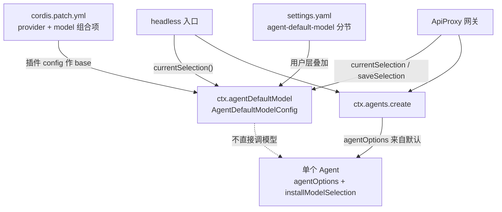
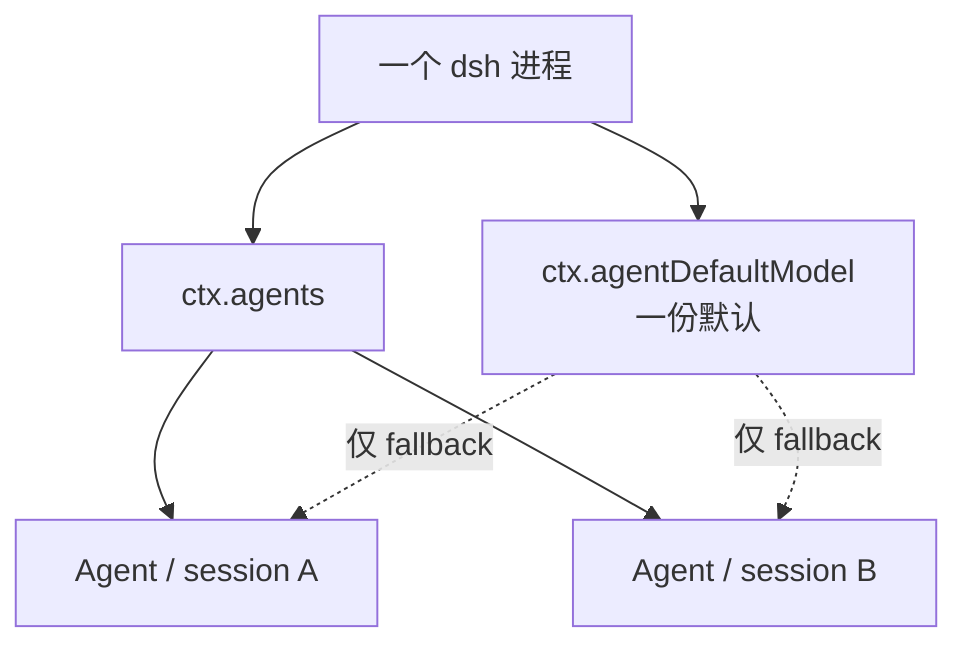
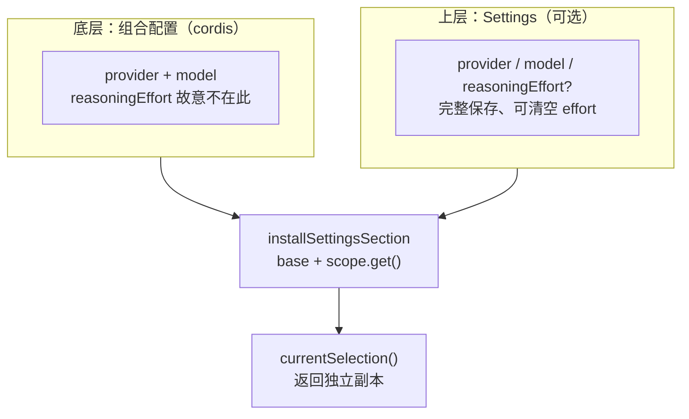
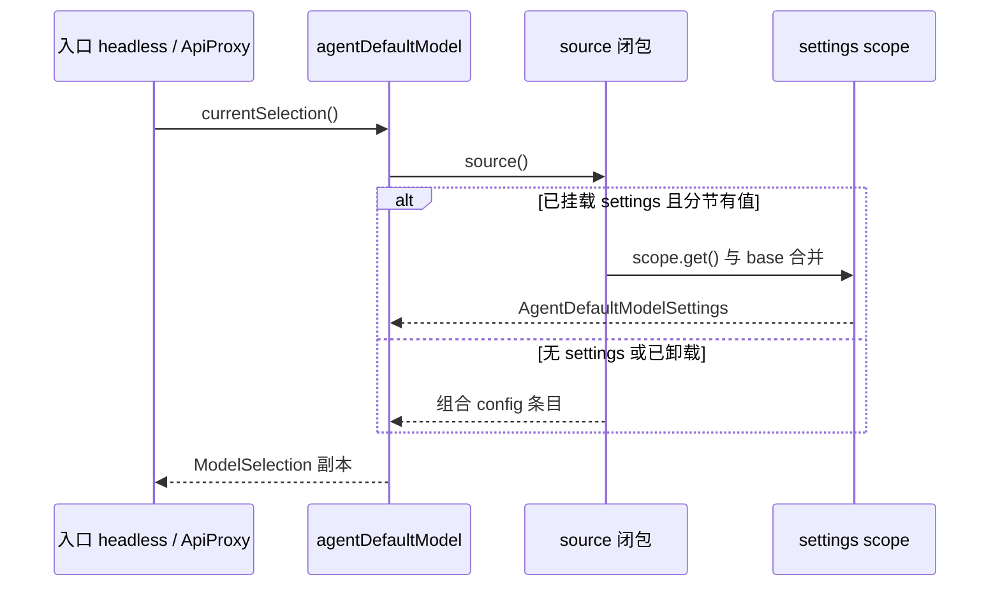
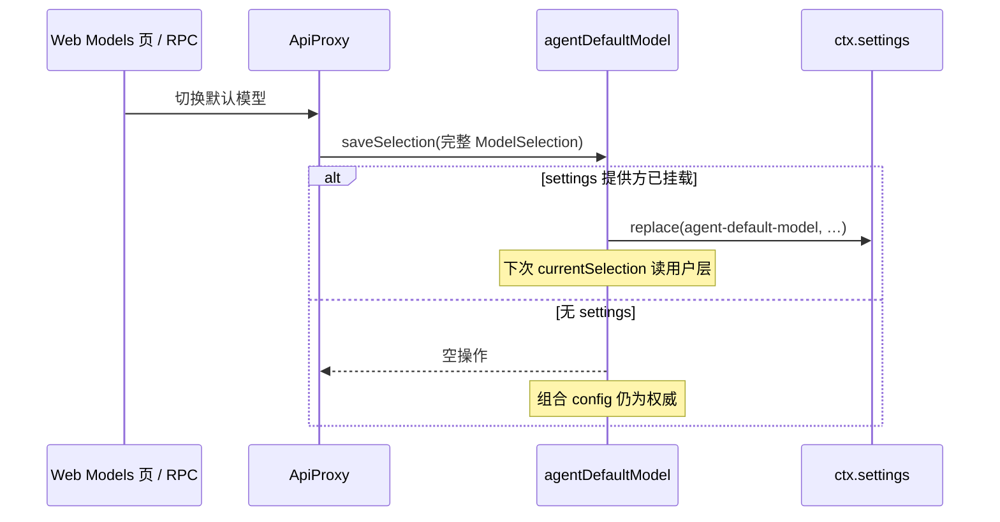
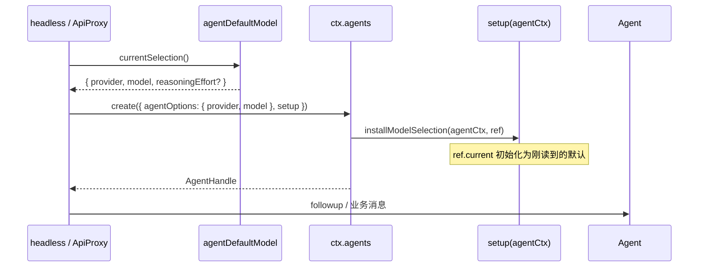
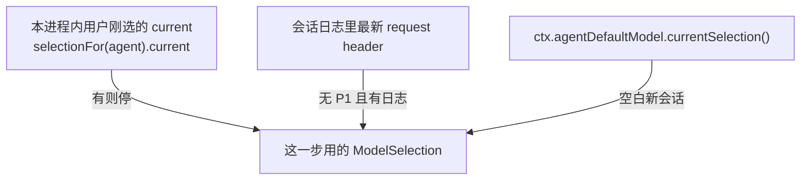

# 00 — 总览：先把图看懂

后面每一章都是这几张图上的一块。卡住时回到这里对位置。

本包只管**进程里一份共享的默认模型选择**（`provider` / `model` / 可选 `reasoningEffort`）。它**不**驱动 Agent 循环、**不**校验目录里有没有这个模型；入口在**创建尚无会话级选型的 Agent** 时读它，再通过 [`dsh-agent` 的 `installModelSelection`](../../agent/src/model-selection.ts) 挂到单个 Agent 上。

## 1. 对象关系：谁挂在谁身上

读图口诀：

| 你看到的 | 它是什么 | 细节 |
|----------|----------|------|
| `ctx.agentDefaultModel` | 进程级默认模型服务 | [03](./03-读与写API.md) |
| `cordis.yml` 里的 `{ provider, model }` | 没 Settings 时的兜底 | [02](./02-两层默认值.md) |
| `settings` 分节 `agent-default-model` | 用户保存的完整选择 | [02](./02-两层默认值.md) |
| headless / ApiProxy | 两个入口读**同一**服务 | [04](./04-入口怎么消费.md) |
| 单个 Agent 的 session 日志 | 已有会话的权威选型 | [05](./05-与单个Agent衔接.md) |

### 进程共享 ≠ 所有会话共用

**进程共享**只描述 `ctx.agentDefaultModel`：全进程一份默认来源。每个 Agent 仍有自己的 `session`、inbox 与（日志记下后的）模型选型；详述见 [01 — 进程共享](./01-这是什么.md#process-vs-session)。

## 2. 两层默认值从哪来

`reasoningEffort` 只在 Settings 分节里：用户换到不支持推理强度的模型时，必须能**清掉**旧 effort；若写进组合 config，卸载 Settings 后又会继承回来。

## 3. 读：`currentSelection()`

每次调用都**现读**；没有进程内缓存。Settings 文档热更新后，下一次 `currentSelection()` 即见新值。

## 4. 写：`saveSelection()`

未挂载 Settings 时 `saveSelection` **静默 no-op**——不是抛错，而是无法跨进程/重启保留用户选择。

## 5. 入口怎么消费（创建新 Agent）

headless 在 Loader 结算后才创建 Agent；ApiProxy 在每次 create/resume 的 `agentOptions()` 里**重新**读默认，避免 stale。

## 6. 默认 vs 单个 Agent：谁赢

本包只提供**最后一档** fallback。ApiProxy 在运行中还有更高优先级：

已有会话、日志里已经记过 provider/model 的，**不会**因为改了进程默认而 retroactively 变模型；改默认只影响之后新 resolve 的 Agent / 空白会话。

## 读图之后

按 [README](./README.md) 下钻各章。Agent 把手、inbox、轮次流见 [`../../agent/guide/`](../../agent/guide/README.md)。合同原文：[README.zh.md](../README.zh.md)。
