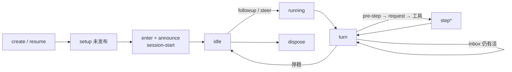
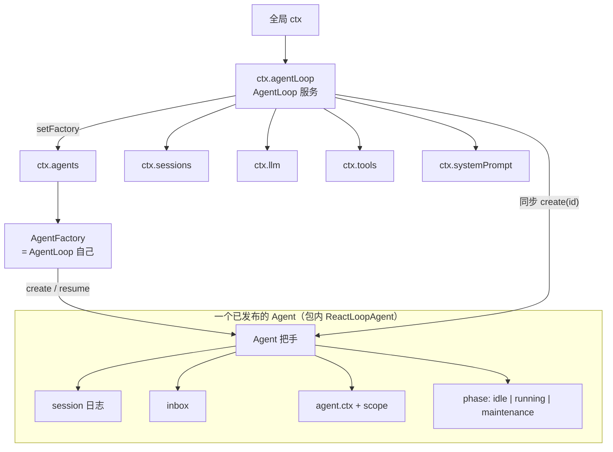
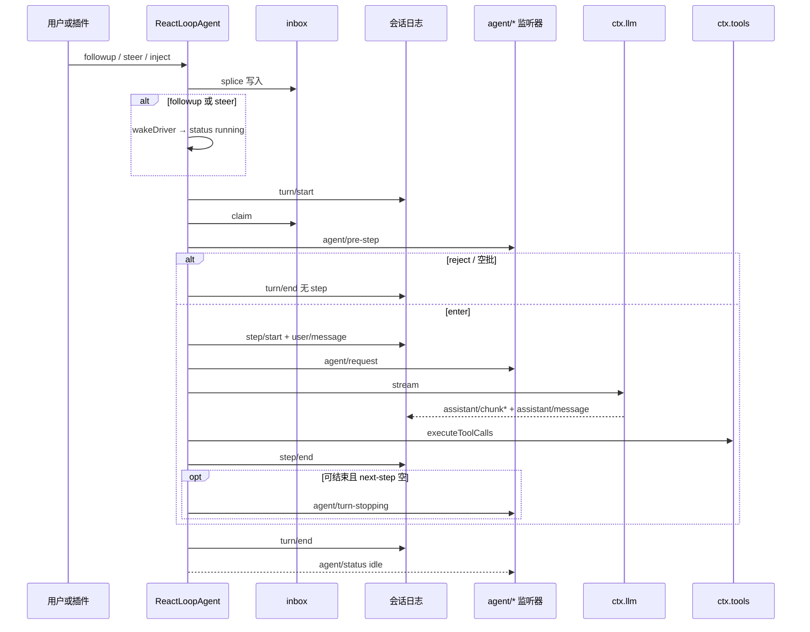
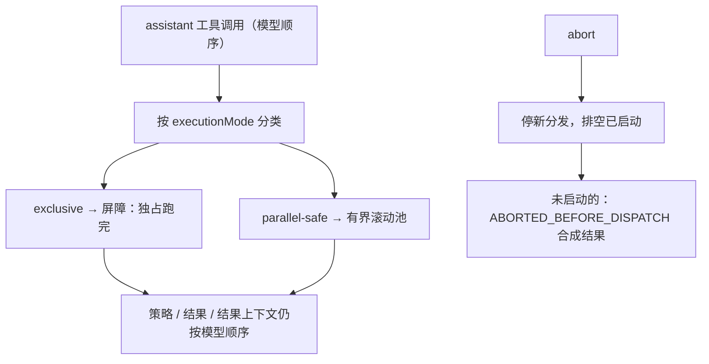
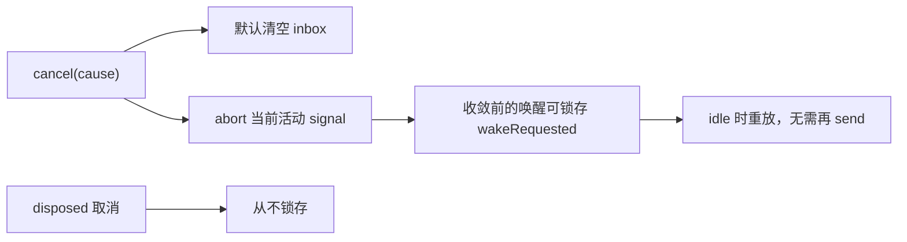

# 00 — 总览：先把图看懂

后面每一章都是这几张图上的一块。卡住时回到这里对位置。

本包实现 **`AgentLoop`（`ctx.agentLoop`）**：具体循环驱动器。它通过 `ctx.agents.setFactory(this)` 成为创建工厂；真正开车的是包内 **`ReactLoopAgent`**（不对外导出）。接口词汇在 [`dsh-agent`](../../agent/guide/README.md)。官方细图：[架构 · 轮次流程](../../../../docs/architecture.zh.md#turn-flow)、[时序图](../../../../docs/agent-lifecycle.zh.md)。

一张图记住一生：



<a id="objects"></a>

## 1. 对象关系：谁挂在谁身上



| 你拿到的 | 它是什么 | 细节 |
|----------|----------|------|
| `ctx.agentLoop` | 循环服务 + 工厂 | [02](./02-AgentLoop服务.md) |
| `ReactLoopAgent` | 包内 `Agent` 实现（不导出） | [03](./03-ReactLoopAgent.md) |
| `ctx.agents.create` | 经工厂走本包的 create/resume | [02](./02-AgentLoop服务.md) · [`dsh-agent` 05](../../agent/guide/05-创建与恢复.md) |
| turn / step | 持久日志边界 + 实时拦截点 | [04](./04-一轮对话.md) |

<a id="publish"></a>

## 2. 从创建到能说话

```mermaid
sequenceDiagram
  participant UI as 调用方
  participant REG as ctx.agents
  participant LOOP as AgentLoop
  participant SETUP as setup
  participant A as ReactLoopAgent

  UI->>REG: create / resume
  REG->>LOOP: createAgent / resume
  LOOP->>LOOP: prepare 会话 + 未发布 agent
  LOOP->>SETUP: await setup(agentCtx)
  Note over SETUP: 只组合，不能 followup
  SETUP-->>LOOP: 可选 commit()
  LOOP->>LOOP: sessions.enter + agents.enter
  LOOP->>LOOP: announce session + agent
  LOOP-->>UI: agent/created
  LOOP-->>UI: agent/session-start
  LOOP->>A: 驱动器已可唤醒
  LOOP-->>UI: AgentHandle
```

同 id 可并行准备，只有一个能 `enter`。创建专用 `signal` 只取消未发布阶段。细节：[02](./02-AgentLoop服务.md)。

<a id="turn"></a>

## 3. 用户发一条消息之后（本包主路径）



`followup` 不返回「这轮做完了」；等停稳用 `whenIdle()`。细节：[04](./04-一轮对话.md)、[05](./05-模型请求.md)。

<a id="tools"></a>

## 4. 一步里的工具怎么排



`maxParallelToolCalls`（默认 10）限制并行池；`1` 等于串行。细节：[06](./06-工具调度.md)。

<a id="cancel"></a>

## 5. 取消要点



空闲时 `cancel` 是空操作。细节：[07](./07-取消与维护.md)。

## 读图之后

按 [README](./README.md) 下钻。接口侧（inbox、注册表、发起方）见 [`../../agent/guide/`](../../agent/guide/README.md)。合同原文：[README.zh.md](../README.zh.md)。
