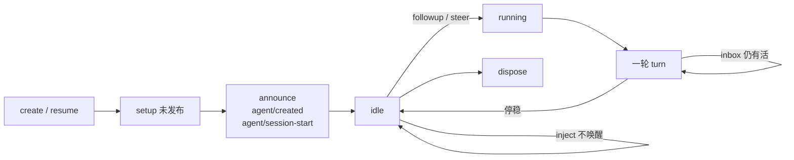
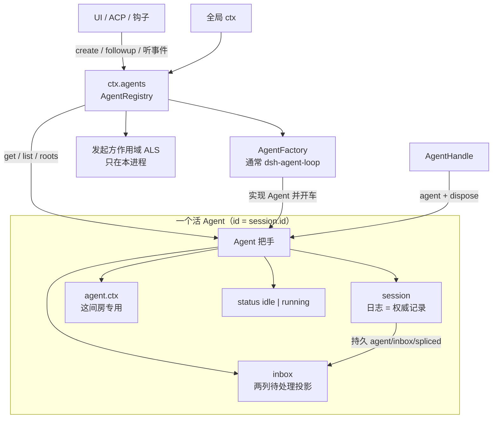
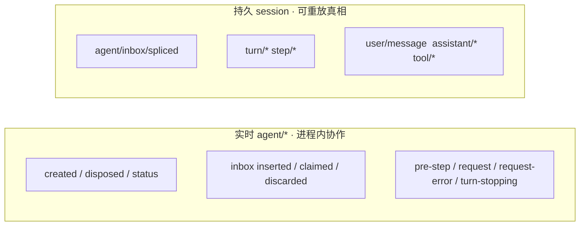
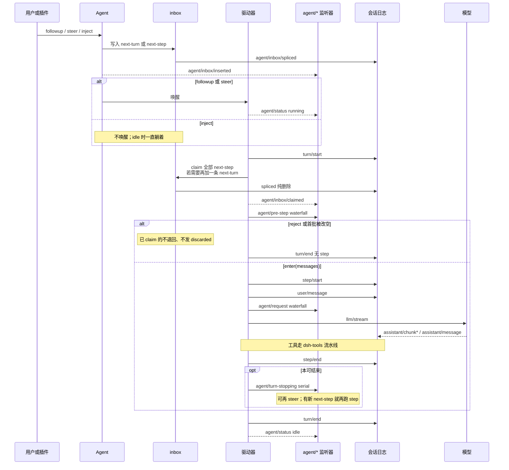
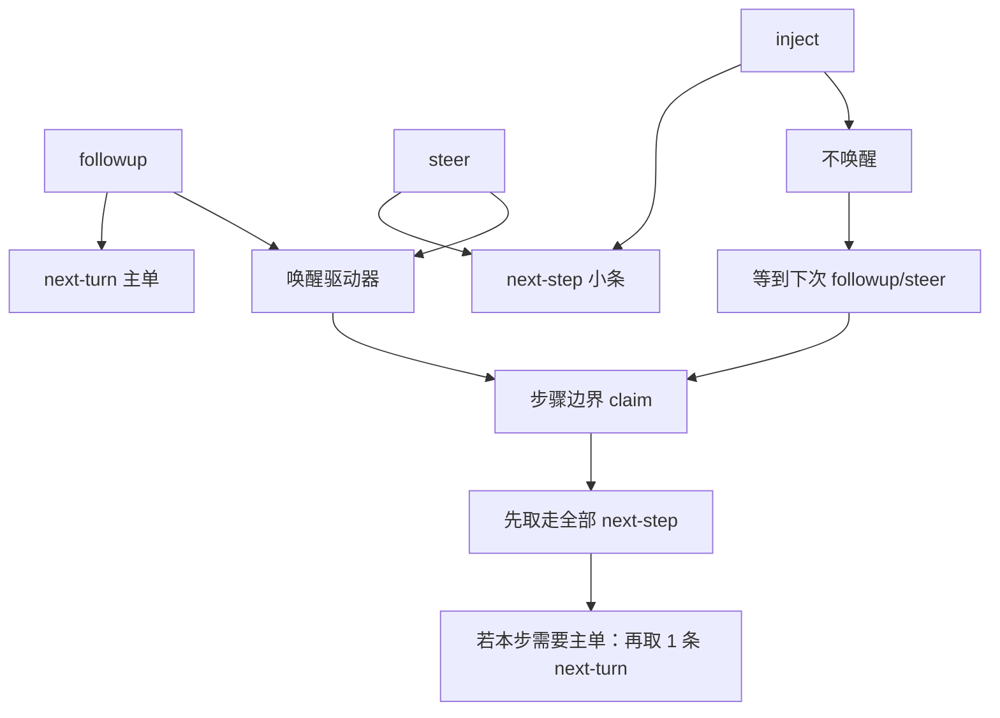
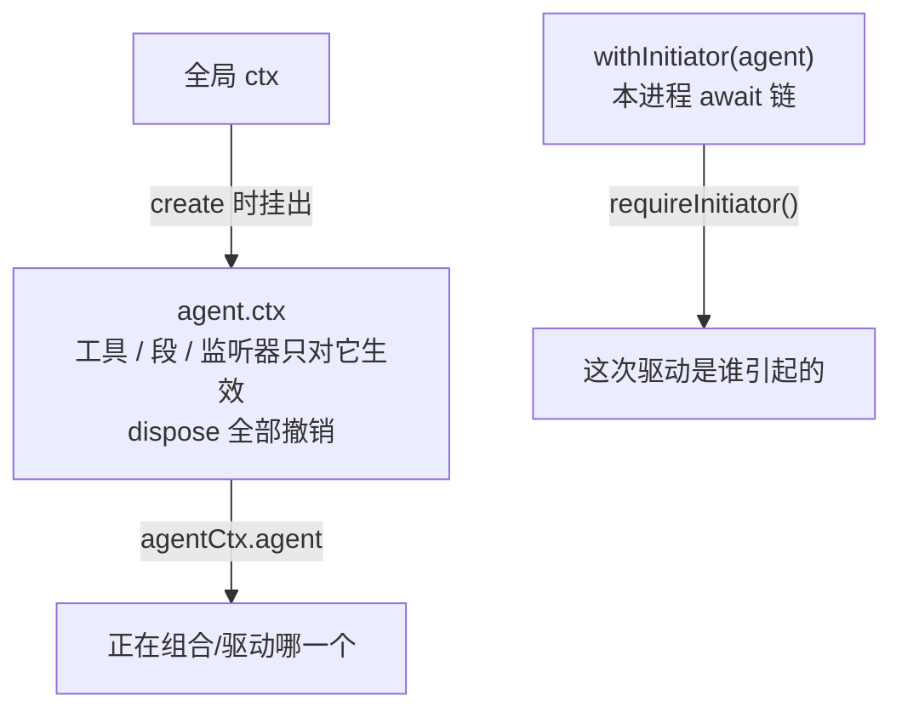
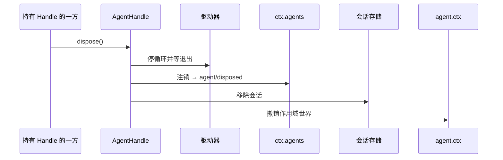

# 00 — 总览：先把图看懂

后面每一章都是这几张图上的一块。卡住时回到这里对位置。

本包只定义**接口、登记册、inbox、发起方作用域、`agent/*` 事件名**。真正一轮轮调模型的是 `dsh-agent-loop`（图里叫「驱动器」）。更细的官方轮次图：[架构 · 轮次流程](../../../../docs/architecture.zh.md#turn-flow)、[时序图](../../../../docs/agent-lifecycle.zh.md)。

一张图记住一生（细节在后面各节展开）：



<a id="objects"></a>

## 1. 对象关系：谁挂在谁身上



读图口诀：

| 你拿到的 | 它是什么 | 细节 |
|----------|----------|------|
| `Agent` | 遥控器 | [02](./02-Agent把手.md) |
| `inbox` | 两列订单架（内存视图） | [03](./03-Inbox收件箱.md) |
| `ctx.agents` | 本进程登记册 + 创建入口 | [04](./04-注册表.md) |
| `AgentHandle` | 遥控器 **加上** 拆掉的权利 | [05](./05-创建与恢复.md) |
| 发起方 ALS | `await` 链上「是谁引起的」 | [06](./06-发起方作用域.md) |
| `agent.ctx` | 只属于这个 Agent 的 Cordis 世界 | [04](./04-注册表.md) |

两个容易混的「父」：**运行时 owner**（`roots` / `isOwnedBy`）问创建时有没有父 Agent 的 scoped context；**持久 `parentSession`** 问磁盘上的会话谱系。从磁盘 resume 回来的 fork，谱系上可以有父会话，运行时仍可能是 `roots()` 之一。

<a id="ledgers"></a>

## 2. 两套账：实时通知 vs 持久日志



Token 流、turn/step 边界**不会**再镜像成一套 `agent/*`。插件拦截走左边；UI 时间线、恢复、对账走右边。事件名与拦截点：[07](./07-实时事件.md)。

<a id="lifetime"></a>

## 3. 从创建到能说话

`create` / `resume` 都走工厂。外界在 `announce` 之前看不见这个 Agent。

```mermaid
sequenceDiagram
  participant UI as 调用方
  participant REG as ctx.agents
  participant FAC as AgentFactory
  participant SETUP as setup
  participant STORE as 会话存储
  participant LOOP as 驱动器

  UI->>REG: create / resume
  REG->>FAC: 委托工厂
  FAC->>FAC: 造未发布的 agentCtx
  FAC->>SETUP: await setup(agentCtx)
  Note over SETUP: 只组合工具/监听器<br/>此时还不能 followup
  SETUP-->>FAC: 可选 commit()
  FAC->>STORE: enter(session)
  FAC->>REG: enter(agent)
  FAC->>REG: announce
  REG-->>UI: agent/created
  FAC-->>UI: agent/session-start
  Note over UI: 第一个可 inject 启动上下文的点<br/>挡不住启动
  FAC->>LOOP: 启动循环
  FAC-->>UI: AgentHandle
```

同 id 可以并行准备，只有一个能 `enter`；失败者回滚自己的私有世界。创建专用 `signal` 只取消「尚未发布」的 setup；返回 handle 之后改用 `dispose()` / `cancel()`。完整约定：[05](./05-创建与恢复.md)。

<a id="turn"></a>

## 4. 用户发一条消息之后

这是日常主路径。驱动器细节以官方轮次图为准；这里只标本包的词汇嵌在哪。



`followup` **不**返回「这轮做完了」。消息 id 只标识 inbox 的插入 / 领取 / 丢弃；输出去看会话事件。要等整机停稳用 `whenIdle()`。`running` 覆盖收尾、落盘、连续排队的多轮，不等于「某个 turn 一定还开着」。

<a id="send"></a>

## 5. 三条进 inbox 的路



`claim` 是循环内部操作；插件日常只用 `followup` / `steer` / `inject`。领取 vs 取消：[03](./03-Inbox收件箱.md)。

<a id="who"></a>

## 6. 三层「当前是谁」不要混



创建、读持久化、未发布的 setup 在**子发起方边界之外**：父发起的 setup 里，`currentInitiator()` 往往是父，而 `agentCtx.agent` 是子。ALS 出不了进程，有 Agent 也不等于还活着或已授权。[06](./06-发起方作用域.md)。

<a id="dispose"></a>

## 7. 拆掉



只有 `AgentHandle.dispose()` 是消费方拆机能力；`ctx.agents.get(id)` 拿到的裸 `Agent` 不能靠这个 disposer 拆。调用方 fiber 与工厂提供方是结构化共同拥有者。

## 读图之后

按 [README](./README.md) 的顺序下钻各章。模型实际吃到什么、现在还做不到什么：[08](./08-模型体验与限制.md)。合同原文：[README.zh.md](../README.zh.md)。
